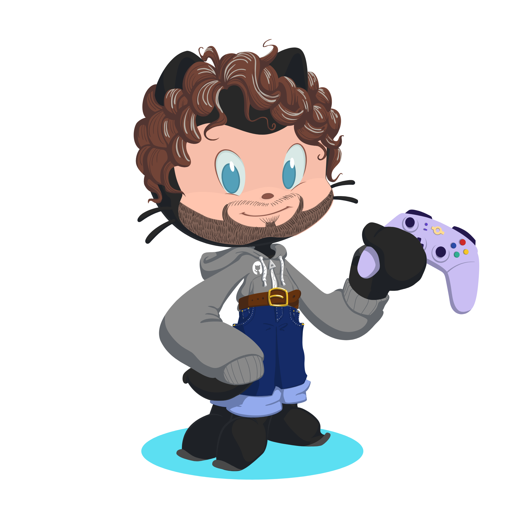
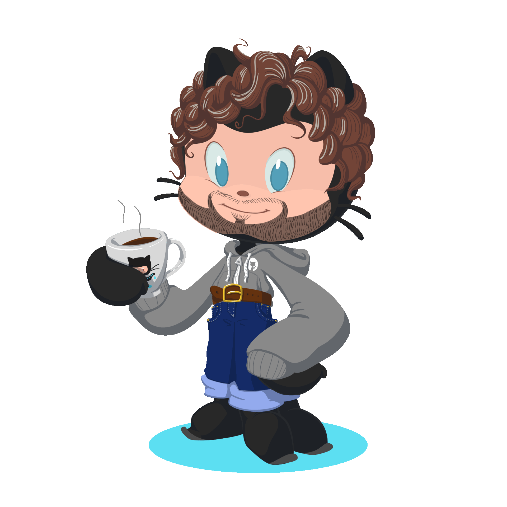

<!--# Grettings! I'm **Igor**, nice to meet you 👋-->
<!---->

  

I'm a programmer, game developer and 2D artist who loves make games and be more creative.

- 💼 I have been working with `Unity Engine` since 2022
- 🎓 Technologician degree on `Digital Games` at Unisinos in 2023
- 🌱 Studing other engines and improving my own skills
- 📋 Responsible, dedicated, and good with team work
- 🏆 During my internship in 2023, one of the games I helpt to develop won a "Best Game" trophy

This GitHub repository serves as a space where I share some of my projects and learning experiences while I'm improving my skills. Please feel free to explore and follow my progress! 

## 📊 Stats
<!--

-->

   <a href="https://github.com/IgorGSoares">
   

      
      
   

## 🛠️ Skills
### Languages and Tools:

  <!---->
  <!---->
  

  
  
  
  
  
  
  
  

### Previously worked with:

  
  
  
  

### Currently learning:

  
  

<!--
    
    
    
  -->

## 🌐 Links

   
   
   

 
  
   
  
  
  

## 🎮 Play Games On

   
   
   
   

<!--Cool effects

-->

<!--SNAKE-->
<!--
<picture>
  <source media="(prefers-color-scheme: dark)" srcset="https://raw.githubusercontent.com/IgorGSoares/IgorGSoares/output/github-contribution-grid-snake-dark.svg">
  <source media="(prefers-color-scheme: light)" srcset="https://raw.githubusercontent.com/IgorGSoares/IgorGSoares/output/github-contribution-grid-snake.svg">
  
</picture>
-->
<!-- -->

<!--PACMAN-->
<picture>
  <source media="(prefers-color-scheme: dark)" srcset="https://raw.githubusercontent.com/IgorGSoares/IgorGSoares/output/pacman-contribution-graph-dark.svg">
  <source media="(prefers-color-scheme: light)" srcset="https://raw.githubusercontent.com/IgorGSoares/IgorGSoares/output/pacman-contribution-graph.svg">
  
</picture>
